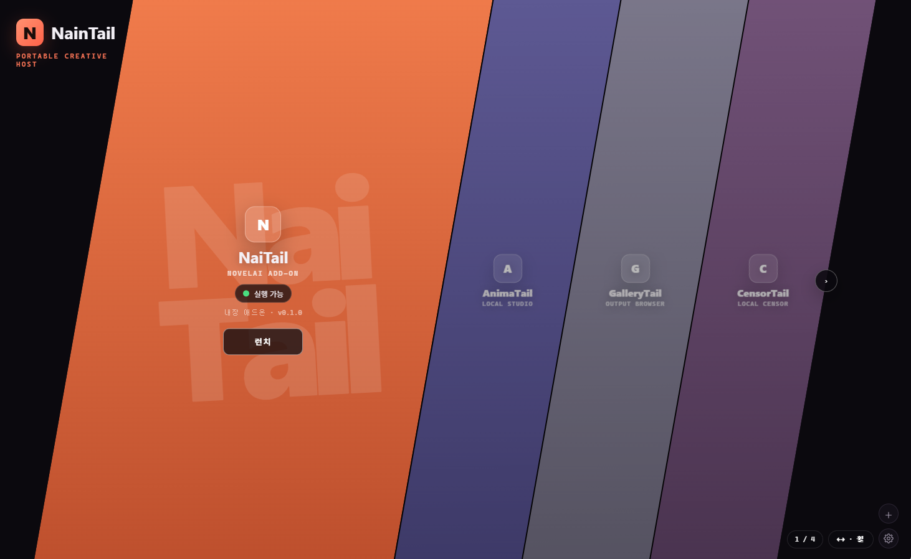
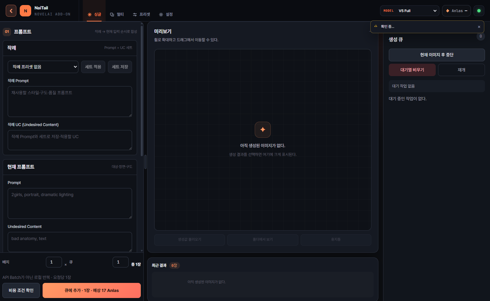
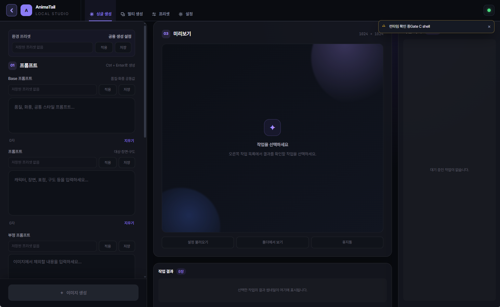
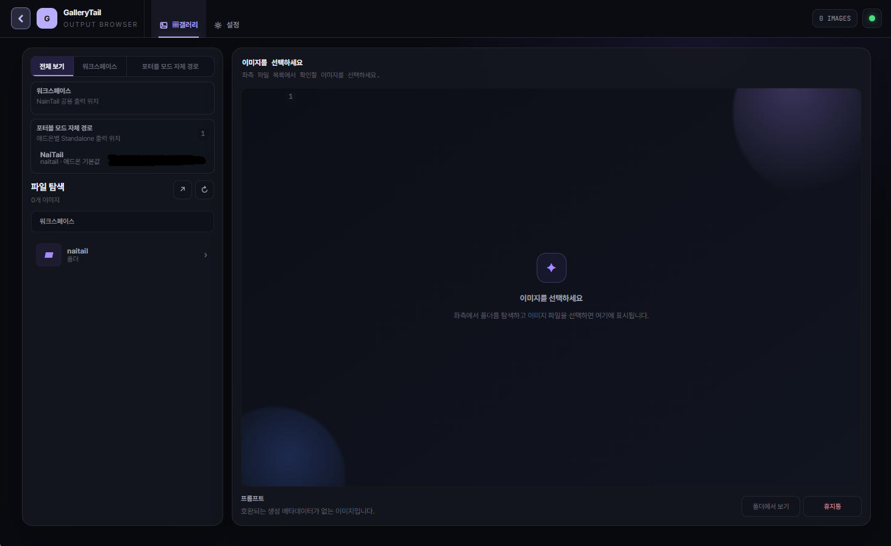
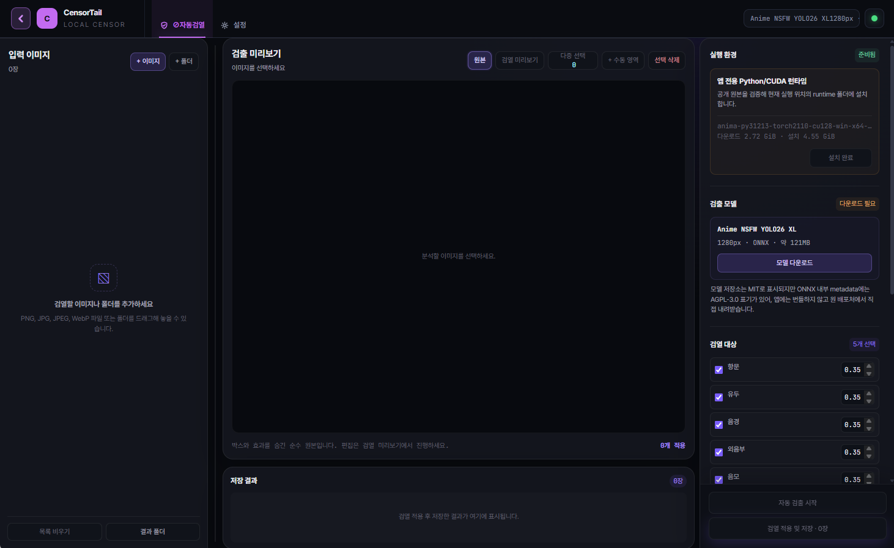
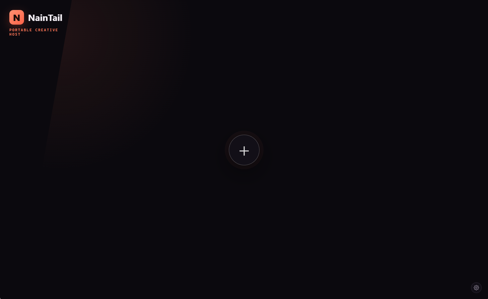
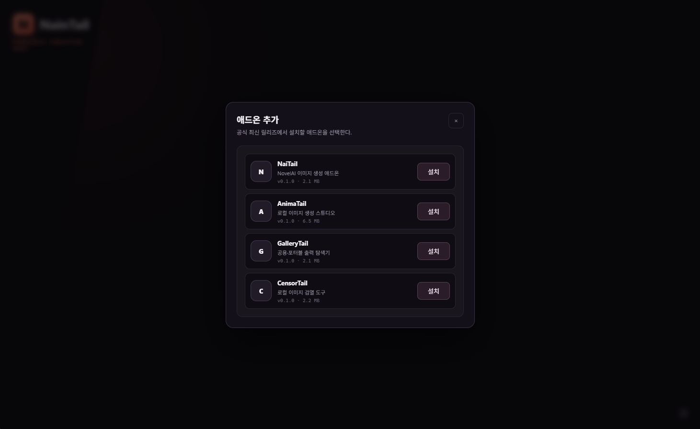
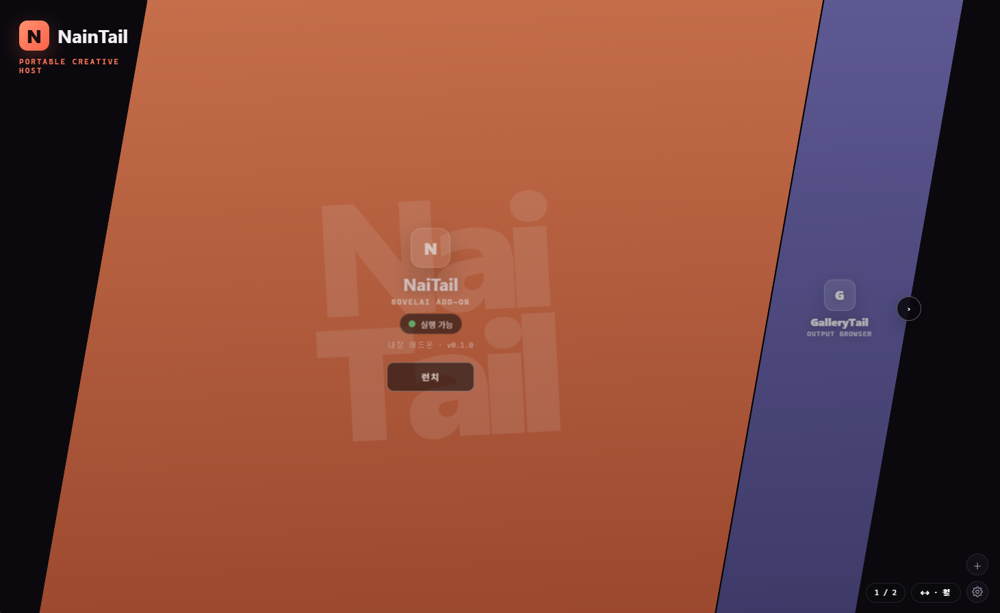

# NainTail

**그림을 만들고, 취향을 찾고, 결과를 정리하는 나만의 작업 공간.**

NainTail은 AI 이미지 작업에 필요한 도구를 한곳에 모아 쓰는 Windows 포터블 앱입니다.

NovelAI로 이미지를 만들고, 내 PC에서 Anima를 실행하고, 완성된 그림을 둘러보거나 검열할 수 있습니다. 각각의 도구는 **Tail**이라는 애드온으로 제공되니, 처음부터 모두 설치할 필요는 없습니다.

빈 홈의 `+` 버튼에서, 지금 필요한 Tail부터 추가해 보세요.

[다운로드](https://github.com/Fintail86/NainTailUtil/releases) · [자세한 문서](Docs/README.md)

## 어떤 작업을 하고 싶나요?

### NaiTail — 만들고, 비교하고, 내 취향을 찾아보세요

NovelAI 이미지 생성을 위한 작업 도구입니다. 프롬프트와 캐릭터를 설정하고, 여러 작업을 큐에 담아 순서대로 생성할 수 있습니다. 자주 사용하는 설정은 프리셋으로 저장해 다시 꺼내 쓰세요.

**작례 연구기**에서는 작가별 그림체를 비교하고, 마음에 드는 샘플을 Favorites에 모을 수 있습니다. 여러 작가를 조합하고 결과를 평가하면서 선호하는 조합을 탐색한 뒤, 가중치를 직접 조절해 다듬을 수도 있습니다.

### AnimaTail — 내 PC에서 이미지 생성

로컬 Anima 모델로 이미지를 생성하는 작업 공간입니다. 사용할 모델과 LoRA를 관리하고, 프롬프트와 생성 설정을 조절하며 작업할 수 있습니다.

처음 실행할 때 필요한 실행 환경의 설치를 안내합니다. 로컬 생성에는 모델과 호환되는 GPU 환경이 필요합니다.

### GalleryTail — 만들어 둔 그림을 한눈에

생성한 이미지를 폴더별로 둘러보고, 크게 열어 확인하는 이미지 탐색기입니다.

NainTail의 공용 출력 폴더와 애드온별 포터블 저장 위치를 구분해서 볼 수 있어, 여러 Tail에서 만든 결과를 찾아보기 편합니다.

### CensorTail — 검열 작업도 로컬에서

이미지에서 검열할 영역을 자동으로 찾고, 결과를 확인하고 수정해 저장하는 도구입니다.

자동 검출을 초안으로 사용하고, 빠진 영역이나 불필요하게 잡힌 영역은 마스크·박스 편집으로 직접 다듬을 수 있습니다.

## 시작은 간단하게

1. [릴리즈 페이지](https://github.com/Fintail86/NainTailUtil/releases)에서 호스트 파일인 `NainTail-버전-win-x64.zip`을 받으세요.
2. 원하는 폴더에 압축을 풀고 `NainTailUtil.bat`을 실행하세요.
3. 홈 중앙의 `+` 버튼을 눌러 사용할 애드온을 설치하세요.
4. 홈에 추가된 Tail을 선택하고 실행하세요.

별도의 Electron 설치가 필요하면 첫 실행에서 내려받습니다. 애드온에 필요한 추가 실행 환경과 모델은 해당 기능을 사용할 때 안내합니다.

### 처음에는 가볍게

### 필요한 도구를 고르고

### 나만의 작업 공간으로

설치 후에도 홈의 `+` 버튼으로 다른 Tail을 추가할 수 있습니다.

## 함께 써도, 따로 써도

NainTail 안에서 실행하면 여러 애드온의 결과를 하나의 출력 위치 아래에 모아 관리할 수 있습니다. 같은 실행 환경을 사용하는 애드온끼리는 이미 설치된 항목을 재사용해 중복 설치를 줄입니다.

NaiTail, AnimaTail, CensorTail은 **독립 실행**도 지원합니다. 필요한 애드온만 별도의 폴더에 두고 포터블 도구처럼 사용할 수 있습니다.

참고로 **NainTail**은 홈과 애드온을 관리하는 앱이고, **NaiTail**은 NovelAI 이미지 생성을 담당하는 애드온입니다. 이름의 `n` 하나 차이입니다.

## 필요한 때에 설치하고 업데이트하세요

호스트와 애드온은 각각 업데이트됩니다. NaiTail만 새 버전이 나왔다면, 다른 Tail까지 다시 받을 필요는 없습니다.

애드온 추가 화면에서 설치 여부와 업데이트 가능 여부를 확인할 수 있고, 호스트 자체의 업데이트는 설정에서 확인할 수 있습니다. 업데이트는 사용자의 확인을 거쳐 진행하며, 기존 애드온과 설정·생성물·런타임은 보존하도록 구성되어 있습니다.

**기존 호스트 0.1.5 이하를 사용 중이라면**, 업데이트 전에 [0.1.6 전환 안내](Docs/HOST_UPDATE_0.1.6.md)를 확인해 주세요.

## AI 도구와 연결해서 쓰기

직접 화면을 조작하는 것 외에 CLI와 MCP를 통한 사용도 지원합니다.

MCP를 지원하는 AI 도구에 NainTail을 연결하면, 설치된 애드온을 확인하고 지원되는 기능을 호출할 수 있습니다. 애드온마다 연결을 따로 구성할 필요 없이 NainTail을 진입점으로 사용할 수 있습니다.

연결과 개발에 관한 자세한 내용은 [문서 모음](Docs/README.md)에서 확인하세요.

## 사용 전에 알아두세요

- Windows 포터블 환경을 대상으로 합니다.
- NaiTail을 사용하려면 NovelAI 계정과 API 토큰이 필요하며, 생성 비용은 해당 서비스 정책을 따릅니다.
- 로컬 생성과 검열은 설치한 모델과 GPU 환경에 따라 성능 및 호환성이 달라집니다.
- 자동 검열 결과는 저장하기 전에 직접 확인해 주세요.
- 개인 설정, 프리셋, 생성 이미지, 자격증명은 배포 파일에 포함하지 않습니다.

## 더 알아보기

- [문서 모음](Docs/README.md)
- [애드온 개발 안내](Docs/ADDON_DEVELOPMENT_CONTRACT.md)
- [CLI·MCP와 호스트 구조](Docs/NainTail/README.md)
- [제품 소스](NainTailUtil/README.md)

외부 서비스에는 각 서비스의 이용 정책이 적용됩니다. 사용한 폰트·런타임 등 외부 구성 요소의 라이선스 고지는 제품과 각 애드온의 `licenses/`에서 확인할 수 있습니다.
