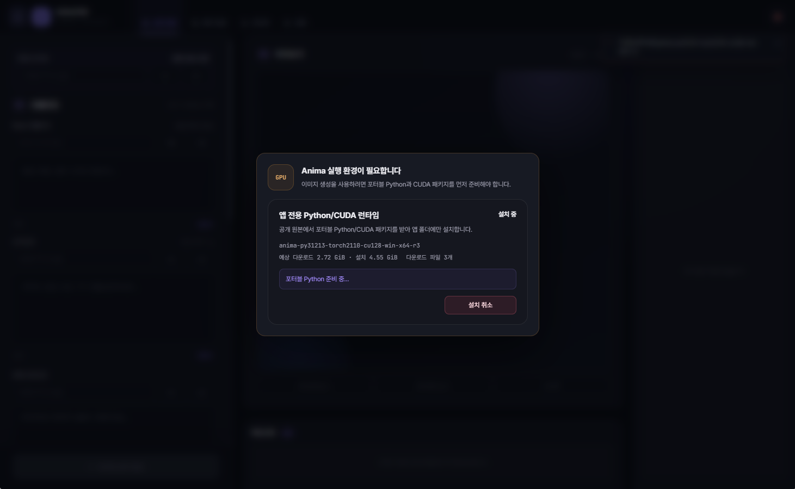

# NainTailUtil

> 필요한 AI 이미지 도구를 하나의 홈에서 골라 쓰는 포터블 크리에이티브 허브.


NainTail은 모든 기능을 한 프로그램에 밀어 넣는 대신, 역할이 다른 도구를 각각의 **Tail**로
나눠 연결한다. NovelAI 생성이 필요하면 NaiTail을, 로컬 이미지 생성이 필요하면 AnimaTail을,
결과 정리와 검열이 필요하면 GalleryTail과 CensorTail을 붙이는 식이다.

호스트는 가볍게 유지하고 각 애드온은 자기 기능·데이터·설정을 독립적으로 소유한다. 그래서
필요한 도구만 설치할 수 있고, 호스트와 애드온을 서로 기다리지 않고 따로 업데이트할 수 있다.

## 설치부터 실행까지

처음 실행하면 비어 있는 홈이 열린다. 중앙의 `+` 버튼에서 공식 애드온을 골라 설치하면,
설치된 Tail이 홈의 카드로 추가되어 바로 실행할 수 있다.

### 1. 처음 실행한 홈


### 2. 공식 애드온 선택과 설치


### 3. 애드온이 연결된 홈


## 필요한 실행 환경 준비

AnimaTail이나 CensorTail처럼 로컬 Python/CUDA 환경이 필요한 Tail은 첫 실행에서 런타임을
확인한다. 필요한 환경이 없으면 다운로드·설치 용량과 진행 상태를 보여주고, 사용자가 설치를
승인하거나 취소할 수 있다. 호스트에서 실행할 때는 각 Tail이 요구한 런타임 ID 중 이미
NainTail 런타임 캐시에 있는 항목을 건너뛰고 없는 항목만 추가하며,
Standalone으로 실행할 때는 해당 애드온 폴더 안에 자체 런타임을 준비한다.



## 각 Tail의 첫 화면

설치된 Tail은 같은 호스트 헤더와 홈 복귀 동작을 공유하면서도, 각 작업에 맞는 독립 화면을
제공한다. 아래 이미지를 누르면 원본 크기로 볼 수 있다.

<table>
  <tr>
    <td width="50%">
      <strong>NaiTail · NovelAI 이미지 생성</strong><br>
      <a href="Docs/assets/readme/naitail-initial-screen.png"></a>
    </td>
    <td width="50%">
      <strong>AnimaTail · 로컬 이미지 생성</strong><br>
      <a href="Docs/assets/readme/animatail-initial-screen.png"></a>
    </td>
  </tr>
  <tr>
    <td width="50%">
      <strong>GalleryTail · 출력 이미지 탐색</strong><br>
      <a href="Docs/assets/readme/gallerytail-initial-screen.png"></a>
    </td>
    <td width="50%">
      <strong>CensorTail · 로컬 이미지 검열</strong><br>
      <a href="Docs/assets/readme/censortail-initial-screen.png"></a>
    </td>
  </tr>
</table>

## 하나의 홈, 필요한 Tail만

- 홈 화면에서 설치된 애드온을 둘러보고 바로 실행한다.
- `+` 버튼으로 공식 애드온을 설치하고 새 버전이 있으면 업데이트한다.
- 애드온 ZIP의 크기와 SHA-256을 검증한 뒤 설치한다.
- 생성물은 하나의 공용 출력 폴더에 모으되 애드온별 영역을 유지한다.
- GUI뿐 아니라 CLI와 MCP에서도 같은 애드온 기능을 사용할 수 있다.
- 프로젝트 폴더 하나를 옮겨 쓰는 Windows 포터블 구성을 지향한다.

## 공식 애드온

| Tail | 하는 일 | 사용 형태 |
|---|---|---|
| **NaiTail** | NovelAI 이미지 생성, 싱글·멀티·작례 연구, 프리셋과 큐 관리 | Hosted / Standalone GUI·CLI·MCP |
| **AnimaTail** | 로컬 Anima 이미지 생성, 모델·LoRA와 생성 워크플로 관리 | Hosted / Standalone GUI·CLI·MCP |
| **GalleryTail** | 공용 워크스페이스와 애드온별 포터블 출력 탐색 | Hosted GUI |
| **CensorTail** | 로컬 이미지 검열, 마스크·박스 편집과 결과 저장 | Hosted / Standalone GUI·MCP |

이름이 비슷하지만 **NainTail**은 홈과 애드온을 관리하는 호스트이고, **NaiTail**은 NovelAI
생성을 담당하는 애드온이다.

## 시작하기

1. [최신 NainTail 릴리즈](https://github.com/Fintail86/NainTailUtil/releases/latest)에서
   `NainTail-*-win-x64.zip`을 받는다.
2. 원하는 폴더에 압축을 푼다.
3. `NainTailUtil.bat`을 실행한다.
4. 빈 홈 중앙의 `+`를 눌러 필요한 공식 애드온을 설치한다.

```text
NainTail/
├─ NainTailUtil.bat
├─ Addons/
├─ outputs/
└─ runtime/
```

Electron이 없으면 첫 실행에서 공식 런타임을 내려받아 크기와 SHA-256을 확인한 뒤
`runtime/electron/`에 설치한다. AnimaTail과 CensorTail의 Python/CUDA 및 모델도 필요한 시점에
설치 안내를 제공한다.

## 호스트에 붙여 쓰기, 따로 꺼내 쓰기

NaiTail, AnimaTail과 CensorTail은 하나의 코드베이스를 두 방식으로 실행한다.

| 모드 | 런타임과 출력 위치 |
|---|---|
| **Hosted** | 애드온이 선언한 런타임 ID를 NainTail의 런타임 캐시에서 찾고, 없는 항목만 설치한다. 출력 루트는 호스트 설정을 따른다. |
| **Standalone** | 애드온 폴더 안의 자체 런타임과 `outputs/`를 사용한다. |

Standalone 애드온은 해당 폴더만 복사해 별도 포터블 유틸처럼 실행할 수 있다. NainTail에
설치하면 같은 기능을 홈·런타임 중복 제거·공용 출력 정책에 연결해 사용한다. 호스트가 하나의
합본 런타임을 정의하는 구조는 아니다. 각 애드온이 필요한 런타임 목록을 소유하며, 서로 같은
ID와 무결성을 요청한 항목만 호스트 캐시에서 재사용한다.

## 독립 버전과 업데이트

호스트와 애드온은 다음 namespace에서 서로 독립적으로 릴리즈된다.

```text
host-vX.Y.Z
naitail-vX.Y.Z
animatail-vX.Y.Z
gallerytail-vX.Y.Z
censortail-vX.Y.Z
```

NaiTail만 변경되면 NaiTail만 새로 배포한다. AnimaTail이나 NainTail 호스트의 버전을 억지로
같이 올리지 않는다. NainTail은 공식 카탈로그에서 각 애드온의 실제 버전을 비교해 `설치`,
`설치됨`, `업데이트` 상태를 표시한다.

호스트 0.1.2부터는 설정에서 NainTail 자체의 공식 버전도 확인한다. 업데이트는 사용자가 승인한
경우에만 내려받으며 크기와 SHA-256 검증, 종료 후 외부 교체, 사용자 데이터 보존과 transaction
복구를 거쳐 재실행한다. `Addons/`, `config/`, `outputs/`, `runtime/`은 호스트 코드와 함께
덮어쓰지 않는다. 기존 0.1.1에는 자기 업데이트 코드가 없으므로 0.1.2로 넘어가는 최초 한 번은
수동 교체가 필요하다.

## CLI와 MCP

호스트는 GUI 외에 다음 진입점을 제공한다.

```text
NainTailUtil_CLI.bat
NainTailUtil_MCP.bat
```

MCP에서는 NainTail 하나만 연결해도 설치된 애드온을 축약 목록으로 조회하고, 필요한 애드온과
도구의 상세 schema만 선택적으로 불러와 호출할 수 있다. 긴 생성 작업은 job ID와 간략 상태를
반환하므로 결과 대기 중 불필요한 토큰 소비를 줄인다.

## 현재 범위

NainTail은 공식 애드온의 발견·설치·업데이트·실행과 runtime ID 캐시·출력 연결을 담당한다.
임의의 제3자 마켓, 앱 안에서의 애드온 제거, 활성/비활성 토글과 복잡한 dependency 자동 해결은
아직 포함하지 않는다.

실제 API 사용에는 해당 서비스 계정과 자격증명이 필요하며, 로컬 생성·검열 기능의 성능과
호환성은 GPU 및 설치한 모델에 따라 달라진다.

## 개발 문서

- [문서 인덱스](Docs/README.md)
- [NainTail 호스트 구조](Docs/NainTail/README.md)
- [애드온 개발 계약](Docs/ADDON_DEVELOPMENT_CONTRACT.md)
- [애드온 출력 위치 계약](Docs/ADDON_OUTPUT_CONTRACT.md)
- [애드온 MCP Profile](Docs/ADDON_MCP_PROFILE.md)
- [공통 UI 시스템](Docs/UI_SYSTEM.md)
- [전체 개발 계획](Docs/DEVELOPMENT_PLAN.md)

제품 코드는 [`NainTailUtil/`](NainTailUtil/README.md)에 있다. 개발용 테스트·빌드 도구·QA
아티팩트·런타임·모델·프리셋·생성물·자격증명은 배포 저장소와 릴리즈 ZIP에 포함하지 않는다.

## 라이선스와 외부 서비스

NovelAI는 NaiTail이 사용하는 외부 서비스이며 사용자의 구독·토큰과 해당 서비스 정책을
따른다. 폰트, 런타임과 참고 구현의 고지문은 제품 및 각 애드온의 `licenses/`에 보존한다.
